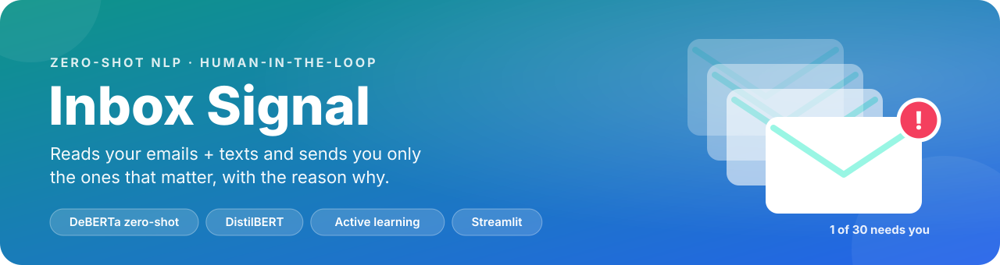
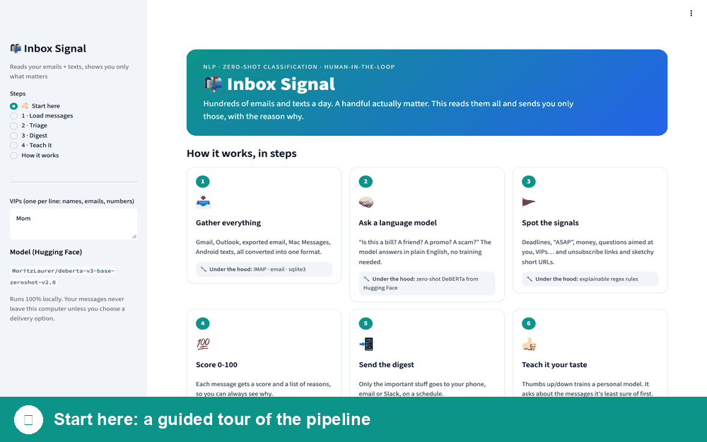
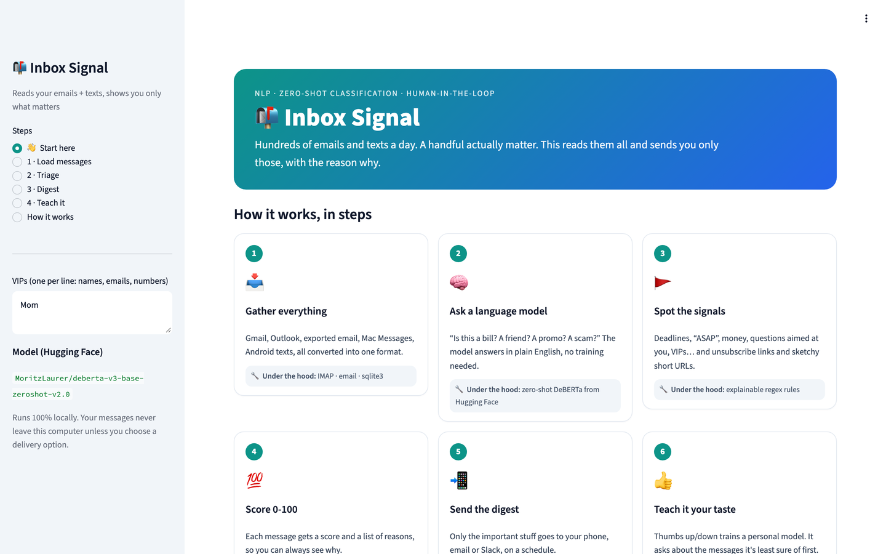
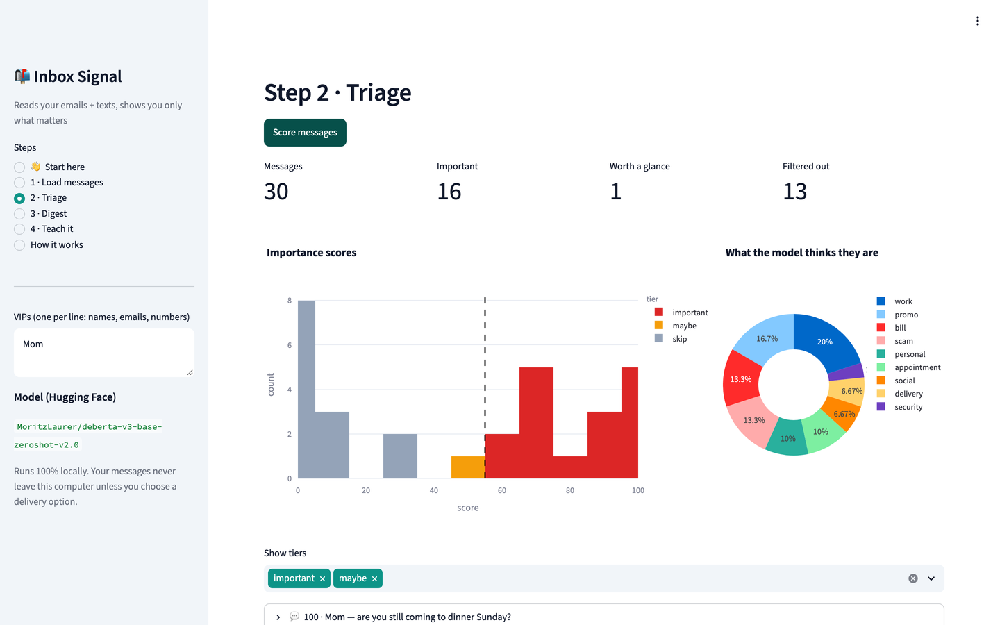
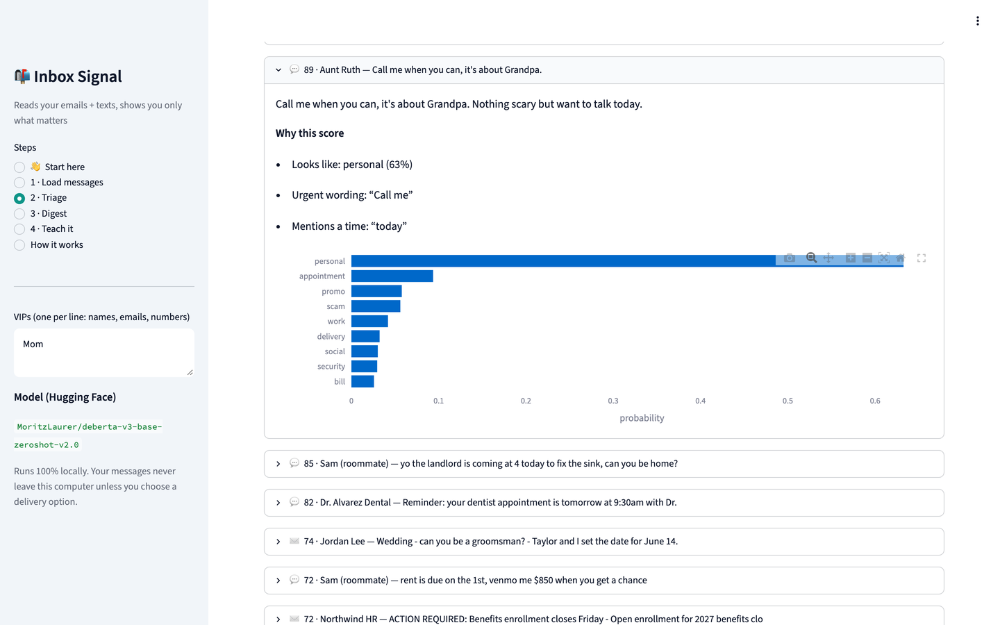
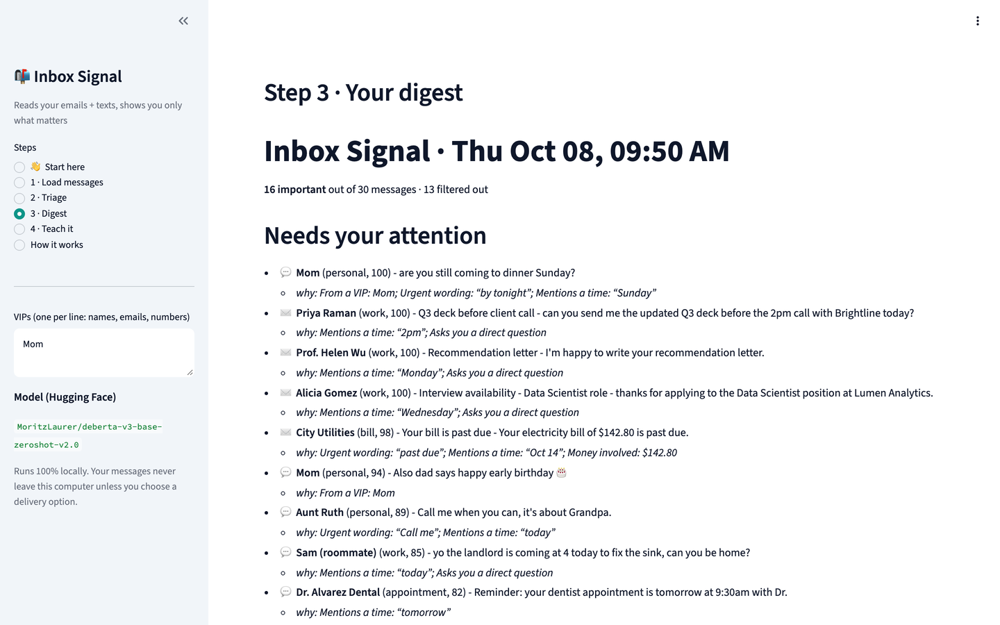
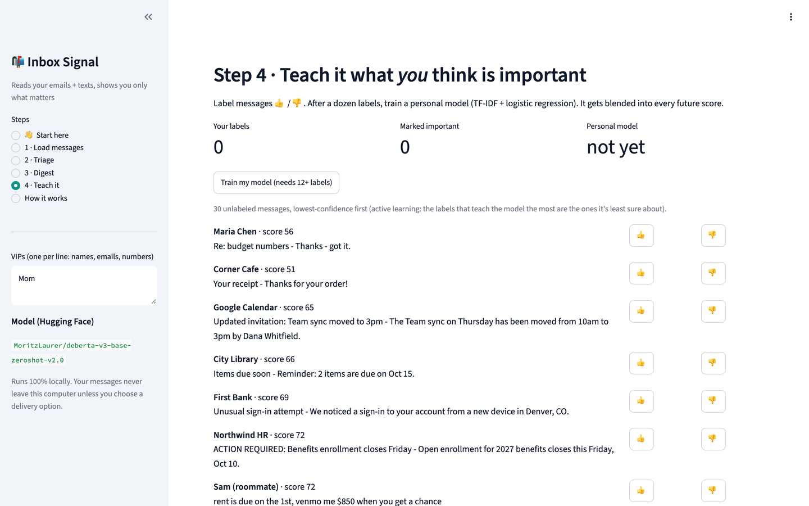
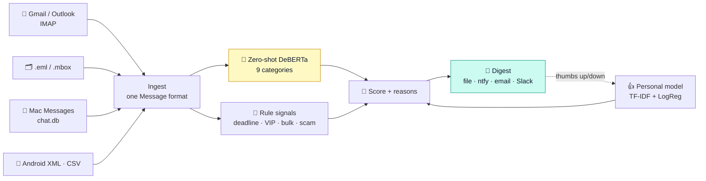

<p align="center">
  
</p>

<p align="center">
  
  
  
  
  
  
</p>

<h3 align="center">Hundreds of emails and texts a day. A handful actually matter.<br>This reads them all and sends you only those, with the reason why.</h3>

<p align="center">
  <a href="#tour">🗺️ Take the tour</a> ·
  <a href="#run">🚀 Run it</a> ·
  <a href="#how">🧠 How it works</a> ·
  <a href="#results">📊 Results</a> ·
  <a href="notebooks/walkthrough.ipynb">📓 Notebook</a>
</p>

<p align="center">
  
</p>

## ✨ What it does

| Feature | What happens |
|---|---|
| 📥 **Gathers everything** | Gmail/Outlook (IMAP), exported email, **Mac Messages**, Android SMS backups, CSV, all in one format. |
| 🧠 **Understands each message** | A zero-shot language model sorts each one into *personal, work, bill, appointment, promo, scam…* with **no training data**. |
| 💯 **Scores it 0–100, with reasons** | Model + explainable signals: deadlines, "ASAP", money, VIP senders, unsubscribe links, sketchy short URLs. |
| 📲 **Sends you the digest** | Only the important stuff, to your phone (ntfy), email or Slack, every morning on a schedule. |
| 👍 **Learns your taste** | Thumbs up/down trains a personal model, starting with the messages it's least sure about. |

---

<a id="tour"></a>
## 🗺️ Take the tour

The app opens on a **👋 Start here** page with a one-click sample inbox: 30 fictional emails and texts. Here's the walkthrough.

### 👋 Start here


Six steps, each with what it does and the technique behind it.

### 1 · Triage: 30 messages in, scored 0–100


The histogram is the whole story: promos, social notifications and scams pile up near **0**, while real people and real deadlines sit near **100**. The dashed line is the "important" cutoff. The donut shows what the model thinks each message is.

<details>
<summary>🔧 <b>Under the hood:</b> zero-shot classification with Hugging Face</summary>

```python
from transformers import pipeline
zs = pipeline("zero-shot-classification", model="MoritzLaurer/deberta-v3-base-zeroshot-v2.0")

zs("Your electricity bill of $142.80 is past due. Pay by Oct 14 to avoid a late fee.",
   candidate_labels=["a bill, payment, or banking notice",
                     "a newsletter or marketing promotion",
                     "a personal message from a friend or family member"],
   hypothesis_template="This message is {}.")
# → bill 0.99, promo 0.01, personal 0.00
```
The model was trained on *natural language inference*: "does sentence A imply sentence B?" Each category becomes a hypothesis ("This message is a bill…"), so **adding a category means writing one sentence** in [`config.py`](inbox_signal/config.py).
</details>

### 2 · Every score has reasons


*"Call me when you can, it's about Grandpa… want to talk today."* scores **89**: the model says *personal* (63%), plus urgent wording ("call me") and a time ("today"). No black box.

<details>
<summary>🔧 <b>Under the hood:</b> how the score is built</summary>

```
base   = Σ P(category) × how important that category usually is   (work .85 · personal .80 · bill .70 … promo .05 · scam 0)
score  = base + VIP .30 + urgent .15 + direct question .10 + time .08 + money .05
              − bulk-mail .25 − link shortener .20 − no-reply sender .10 − short-code .10
≥ 55 → important   ·   35–55 → worth a glance   ·   below → filtered out
```
</details>

### 3 · Your digest


This is what lands on your phone: who, what, and why, sorted by importance. 13 of the 30 messages never bother you.

<details>
<summary>🔧 <b>Under the hood:</b> get it every morning</summary>

```bash
export IMAP_USER="you@gmail.com" IMAP_PASSWORD="your-app-password"
export NTFY_TOPIC="some-long-secret-topic"          # free push notifications: install the ntfy app
python scripts/run_digest.py --imap --days 1 --vip "Mom" "boss@company.com" --deliver ntfy

# crontab -e   →   every day at 8am
0 8 * * * cd /path/to/inbox-signal && .venv/bin/python scripts/run_digest.py --imap --deliver ntfy
```
</details>

### 4 · Teach it what *you* think matters


Click 👍 or 👎. After a dozen labels, **Train my model** fits a personal classifier that gets blended into every future score. Messages are shown **least-confident first** (*uncertainty sampling*, a form of active learning), because those labels teach the model the most.

---

<a id="how"></a>
## 🧠 How it works



| Step | File | Technique |
|---|---|---|
| Ingest | [`ingest.py`](inbox_signal/ingest.py) | `imaplib` (read-only, `BODY.PEEK`), `email`, `mailbox`, `sqlite3` for iMessage |
| Rule signals | [`features.py`](inbox_signal/features.py) | Regex features, each returning its evidence |
| Model | [`models.py`](inbox_signal/models.py) | Hugging Face zero-shot pipeline |
| Score | [`scorer.py`](inbox_signal/scorer.py) | Weighted blend + human-readable reasons |
| Learn | [`personal.py`](inbox_signal/personal.py) | TF-IDF + logistic regression, cross-validated, uncertainty sampling |
| Deliver | [`digest.py`](inbox_signal/digest.py) | Markdown digest → ntfy / SMTP / Slack |
| Compare models | [`scripts/train.py`](scripts/train.py) | Zero-shot vs TF-IDF vs fine-tuned DistilBERT (plain PyTorch loop) |

New to the code? **[`notebooks/walkthrough.ipynb`](notebooks/walkthrough.ipynb)** goes step by step with output, and **[`docs/PROCESS.md`](docs/PROCESS.md)** explains everything in plain English.

---

<a id="results"></a>
## 📊 Results

Real inboxes are private, so [`scripts/make_dataset.py`](scripts/make_dataset.py) generates **1,200 synthetic labeled messages**, including traps like promos that shout "URGENT" and chit-chat that isn't important. Every approach is then tested on **30 hand-written messages in a different style** that no model trained on:

| Model | Accuracy | Precision | Recall | F1 |
|---|---|---|---|---|
| Zero-shot + rules (no training) | 0.87 | 0.81 | 0.93 | 0.87 |
| TF-IDF + logistic regression | 0.93 | 0.88 | **1.00** | 0.93 |
| Fine-tuned DistilBERT (2 epochs) | 0.90 | 0.82 | **1.00** | 0.90 |

**Recall is the metric that matters**: missing a text from your landlord is worse than seeing one extra promo.

> **🎓 Lesson learned: calibration matters.** DistilBERT's training loss fell to 0.003, which means it memorized the templates. On real-looking text it was **overconfident**, rating *"lol did you see the game last night"* 95% important. Blending it into the app left accuracy unchanged (0.87) and made the explanations misleading, so it's **off by default** (`BLEND_FINETUNED` in [`config.py`](inbox_signal/config.py)). A well-calibrated 80% beats an overconfident 100%.

Caveats, stated up front: 30 test messages is small (one message = 3.3 points), so the gaps between models are within noise. The honest next step is labeling a few hundred real messages with the 👍/👎 loop and re-running the comparison.

---

<a id="run"></a>
## 🚀 Run it in 2 minutes

```bash
git clone https://github.com/CohenTheCoder/inbox-signal.git && cd inbox-signal
python3.11 -m venv .venv && source .venv/bin/activate
pip install -r requirements.txt
streamlit run app.py
```

Click **▶ Try it with a sample inbox**, then **Score messages**. The first run downloads the model (~370 MB).

<details>
<summary>📬 Use it on your real messages</summary>

- **Gmail:** turn on 2-step verification, create an [app password](https://myaccount.google.com/apppasswords), then use *Email via IMAP* on step 1. Nothing gets marked as read.
- **iMessage/SMS on a Mac:** give your terminal *Full Disk Access* (System Settings → Privacy & Security), then choose *Mac Messages*.
- **Android:** export with *SMS Backup & Restore* and upload the `.xml`.
- Everything runs on your machine. Messages leave it only through the delivery method you pick.
</details>

<details>
<summary>📁 What's in the repo</summary>

```
inbox_signal/           the pipeline (one file per step)
app.py · tour.py        Streamlit app + its "Start here" tour page
notebooks/              walkthrough.ipynb: load model → classify → score → evaluate
scripts/                make_dataset.py · train.py · run_digest.py (for cron)
data/sample/            30 fictional messages with expected labels
docs/                   PROCESS.md, results.md, screenshots, banner
tests/                  pytest: loaders, iMessage reader, rules (no model downloads)
```
</details>

## 💬 The 30-second version
*"I built a local triage system for email and text messages. A zero-shot DeBERTa model from Hugging Face categorizes messages with no training data, explainable rules add signals like deadlines and scam links, and every message gets a 0–100 score with reasons. It sends a daily digest to my phone, and a thumbs up/down loop trains a personal model using uncertainty sampling. I also fine-tuned DistilBERT and found it was overconfident even though recall was perfect, so I kept it out of production. Good calibration beat raw accuracy."*

---

<sub>All sample names, companies and messages are fictional. MIT licensed.</sub>
