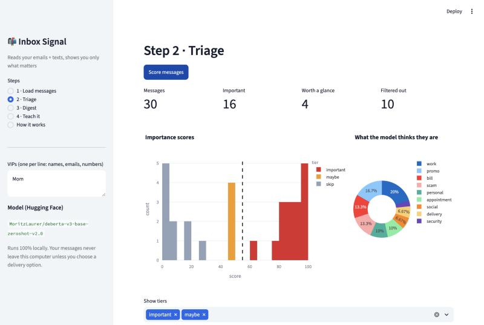

# 📬 Inbox Signal

**Reads your emails and text messages and sends you only the ones that matter.**

Inbox Signal pulls messages from Gmail/Outlook (IMAP), email exports, the Mac Messages app, or
Android SMS backups. It classifies each one with a **zero-shot transformer from Hugging Face**,
adds explainable rule signals (deadlines, urgent wording, VIP senders, unsubscribe links,
scam-style short links), and scores it 0–100. You get a short digest by file, phone push,
email, or Slack, and every score comes with the reasons behind it.

It also **learns from you**: 👍/👎 in the app trains a personal model, and it asks first about
the messages it's least sure of (active learning).



---

## Quickstart

```bash
git clone https://github.com/CohenTheCoder/inbox-signal.git
cd inbox-signal
python3.11 -m venv .venv && source .venv/bin/activate
pip install -r requirements.txt
streamlit run app.py
```

In the app: **1 · Load messages → Sample inbox → 2 · Triage → Score messages**. The first run
downloads the zero-shot model (~370 MB).

New to the code? Open **[notebooks/walkthrough.ipynb](notebooks/walkthrough.ipynb)**. It walks
through loading the model, classifying a message, scoring, and training, one cell at a time.

### Use it on your real inbox
- **Gmail:** turn on 2-step verification, create an [app password](https://myaccount.google.com/apppasswords),
  then use *Email via IMAP* in the app. Mail is read with `BODY.PEEK`, so nothing gets marked as read.
- **iMessage/SMS on a Mac:** give your terminal *Full Disk Access* (System Settings → Privacy &
  Security), then choose *Mac Messages*.
- **Android:** export with *SMS Backup & Restore* and upload the `.xml` file.

Everything runs locally. Your messages leave your machine only through the delivery method you choose.

### Get a digest every morning
```bash
export IMAP_USER="you@gmail.com" IMAP_PASSWORD="your-app-password"
export NTFY_TOPIC="some-long-secret-topic-name"     # install the free ntfy app and subscribe to it
python scripts/run_digest.py --imap --days 1 --vip "Mom" "boss@company.com" --deliver ntfy
```
Schedule it with `crontab -e`:
```
0 8 * * * cd /path/to/inbox-signal && .venv/bin/python scripts/run_digest.py --imap --deliver ntfy
```

---

## How it works

| Step | What happens | Tools |
|---|---|---|
| 1. Ingest | IMAP, .eml, .mbox, CSV, Android XML, and macOS `chat.db` all become one `Message` format | `imaplib`, `email`, `sqlite3`, BeautifulSoup |
| 2. Rule signals | Regex for urgency, times/dates, money, direct questions, bulk-mail and scam tells, VIPs | `re` |
| 3. Zero-shot model | `pipeline("zero-shot-classification", model="MoritzLaurer/deberta-v3-base-zeroshot-v2.0")` sorts each message into 9 plain-English categories, no training data needed | 🤗 transformers |
| 4. Score | Σ P(category) × category importance, plus boosts/penalties, averaged with any trained models | numpy |
| 5. Digest | Markdown summary → file, ntfy push, SMTP email, or Slack | requests, smtplib |
| 6. Learn | 👍/👎 → TF-IDF + logistic regression personal model; uncertainty sampling picks what to ask | scikit-learn |

Full explanation: **[docs/PROCESS.md](docs/PROCESS.md)**.

## Results

Real inboxes are private, so `scripts/make_dataset.py` generates **1,200 synthetic labeled
messages** from templates, including traps like promos that say "URGENT" and personal chit-chat
that isn't important. `scripts/train.py` then tests every approach on **30 hand-written messages
in a different style** that no model trained on:

| Model | Accuracy | Precision | Recall | F1 |
|---|---|---|---|---|
| Zero-shot + rules (no training) | 0.87 | 0.81 | 0.93 | 0.87 |
| TF-IDF + logistic regression | 0.93 | 0.88 | **1.00** | 0.93 |
| Fine-tuned DistilBERT (2 epochs, plain PyTorch loop) | 0.90 | 0.82 | **1.00** | 0.90 |

**Recall** is the metric that matters most here: missing a text from your landlord is worse
than seeing one extra promo.

**Calibration lesson:** DistilBERT's training loss fell to 0.003, which means it memorized the
templates. On real-looking text it is *overconfident*: it rated "lol did you see the game last
night" 95% important. Blending it into the app's score left accuracy unchanged (0.87) and made
the explanations misleading, so it's **off by default** (`BLEND_FINETUNED` in `config.py`). A
well-calibrated 80% beats an overconfident 100%.

Caveats, stated up front: 30 test messages is small (one message = 3.3 points), so the gap
between the models is within noise. Synthetic training data also can't capture the variety of
a real inbox. That's why the app has a 👍/👎 loop. The honest next step is to label a few hundred
of your own messages and re-run the comparison.

## Project structure

```
inbox_signal/
  ingest.py     # all the message sources
  features.py   # rule-based signals + one-line gist
  models.py     # Hugging Face zero-shot pipeline (+ fine-tuned model if present)
  scorer.py     # combine into 0-100 score with reasons
  personal.py   # feedback storage + personal model
  digest.py     # build + deliver the digest
app.py          # Streamlit UI
scripts/        # make_dataset.py · train.py · run_digest.py
notebooks/walkthrough.ipynb
data/sample/messages.json   # 30 fictional messages with expected labels
tests/
```

Ideas to extend: thread awareness (a reply to *your* email matters more), calendar
cross-checks, summarizing long emails with a small seq2seq model, and per-sender learning.
